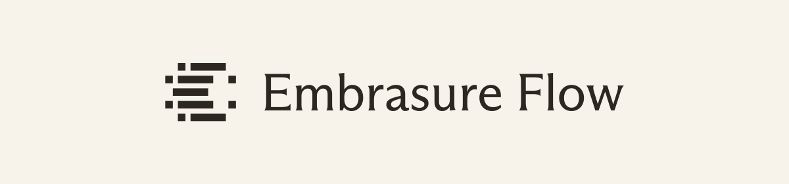
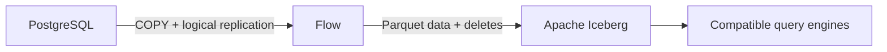

<p align="center">
  <a href="https://embrasure.ai">
    
  </a>
</p>

<h1 align="center">Flow</h1>

<p align="center">
  Stream PostgreSQL changes into Apache Iceberg. Written in Rust.
</p>

<p align="center">
  <a href="https://github.com/EmbrasureAI/flow/actions/workflows/ci.yml"></a>
  <a href="https://github.com/EmbrasureAI/flow/actions/workflows/services.yml"></a>
  <a href="LICENSE"></a>
</p>

<p align="center">
  <a href="docs/README.md">Documentation</a> ·
  <a href="demo/README.md">Quickstart</a> ·
  <a href="docs/performance.md">Benchmarks</a> ·
  <a href="CONTRIBUTING.md">Contributing</a> ·
  <a href="https://github.com/EmbrasureAI/flow/issues">Issues</a>
</p>

Flow copies existing PostgreSQL rows, then continuously replicates inserts,
updates and deletes into standard Iceberg tables. Query the tables directly
through a compatible Iceberg reader, using your catalog and object storage.

## Highlights

- **Postgres to Iceberg in one service.** Initial COPY and ongoing logical
  replication, with background compaction in the same Rust process.
- **Standard tables.** Parquet data with Iceberg v2 position deletes or v3 deletion
  vectors, published through an Iceberg REST catalog to S3-compatible storage.
- **Mutable data.** Inserts, updates, deletes and primary-key changes, plus
  append-only ingestion for tables without a primary key.
- **Durable recovery.** A transaction journal, persistent row index and publication
  ledger support replay, reconnects and interrupted-bootstrap recovery.
- **Maintenance alongside ingestion.** Local data/delete compaction and
  reconciliation of external compactor rewrites.

## Quickstart

Run the local demo with Git, Docker and Docker Compose. It includes PostgreSQL,
MinIO, an Iceberg REST catalog, Trino and Flow:

```sh
git clone https://github.com/EmbrasureAI/flow.git
cd flow
docker compose -f demo/compose.yaml up --build -d
```

Once `initialize` has completed and `flow` has started, query the replicated table:

```sh
docker compose -f demo/compose.yaml exec trino trino \
  --execute 'SELECT * FROM lake.replicated.orders'
```

The [demo guide](demo/README.md) walks through changing source rows, checking
service status and cleaning up. The stack uses named volumes and does not
publish ports on the host.

### Build from source

Install the [pinned Rust toolchain](rust-toolchain.toml), a C++ compiler, libclang,
CMake, pkg-config and OpenSSL development headers, then build and validate the
example configuration:

```sh
cargo build --locked --release -p flow-daemon
./target/release/embrasure-flow --config examples/flow.toml check
```

To connect your own services, follow [Getting started](docs/getting-started.md)
to configure the source, catalog and storage, then run `init`, `run` and `status`.
Flow needs persistent disk for its transaction journal and RocksDB row index.
Readers access Iceberg independently of the running service.

## How it works



Flow journals source transactions, materializes data and deletes, and commits
them to the Iceberg catalog. A transaction becomes visible atomically within
each destination table. A source-wide ledger advances acknowledgement only
through completed transactions.

Compaction runs alongside ingestion. Before publishing a rewrite, the
coordinator validates its inputs and translates intervening deletes. External
physical rewrites are reconciled before ingestion reuses row locations.
See the [architecture](docs/architecture.md) and
[compaction protocol](docs/local-compaction.md) for the durable state transitions.

## Support and status

Mutable tables require a stable primary key and `REPLICA IDENTITY FULL`.
Automatic schema evolution supports nullable column additions without a non-null
backfill. TRUNCATE and incompatible schema changes stop capture. Partitioning,
cross-table query atomicity, HA, distributed compaction and Z-order compaction
are not supported. Check [v3 reader compatibility](docs/iceberg-v3.md) and the
[operating limits](docs/getting-started.md#recovery-and-operational-limits)
before deploying.

**Status:** local correctness and recovery integration checks pass. Performance
qualification is incomplete; this is not yet a qualified production release.
The [benchmark report](docs/performance.md) records measured throughput,
publication latency, reader overhead and remaining targets.

## Documentation

| Guide | What you will find |
| --- | --- |
| [Getting started](docs/getting-started.md) | Build, configure, initialize and run Flow |
| [Configuration](examples/flow.toml) | Source, storage, catalog and compaction settings |
| [PostgreSQL type mappings](docs/postgres-types.md) | Supported application types across snapshot and CDC |
| [Observability](docs/observability.md) | Status, watermarks, metrics and operational diagnosis |
| [Iceberg v3](docs/iceberg-v3.md) | Deletion vectors, upgrades and reader compatibility |
| [Code guide](docs/code-guide.md) | Crate responsibilities and module layout |
| [Integration tests](tests/production/README.md) | Service fixtures, reader checks and recovery scenarios |

Browse the [documentation index](docs/README.md) for the full set of guides.

## Contributing

Bug reports, documentation improvements and code contributions are welcome.
Read [Contributing](CONTRIBUTING.md) for development setup, checks and review
expectations. Open an [issue](https://github.com/EmbrasureAI/flow/issues) to discuss
substantial changes or report a bug with reproduction steps.

## License

Flow is licensed under [Apache-2.0](LICENSE). Vendored dependencies retain their
upstream licenses and [attribution notices](NOTICE). See
[distribution notices](licenses/README.md) for the binary license bundle.
